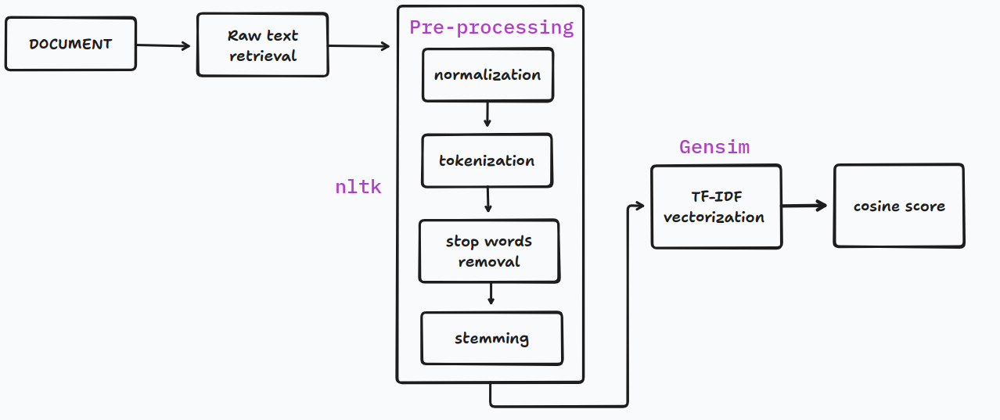
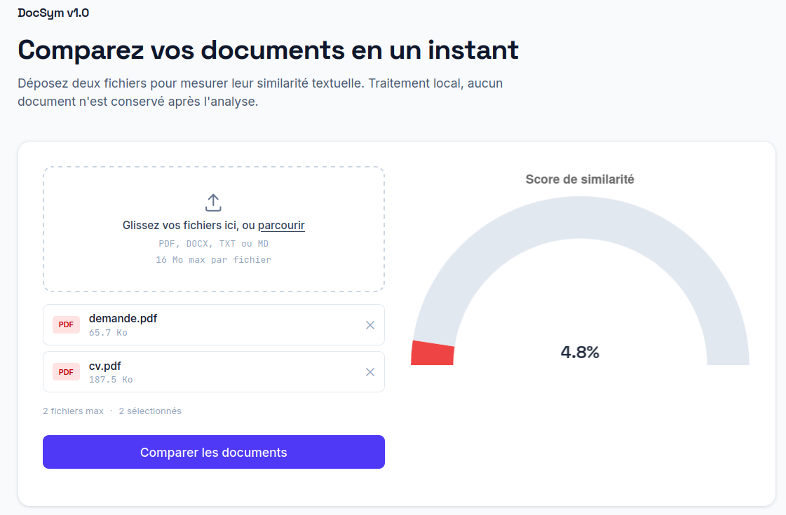

# DocSim v1.0

**DocSim** est une application web basée sur **Flask** permettant de calculer et visualiser la similarité entre deux documents texte. Le projet combine des techniques avancées de Traitement Automatique du Langage Naturel (NLP) pour le prétraitement et la vectorisation des textes, puis affiche le score de similarité sous forme d'une jauge interactive avec **Chart.js**.

## 📊 Diagramme de flux



## 🎬 Démo



## 🚀 Fonctionnalités

- **Prétraitement de texte robuste (NLP)** :
  - Nettoyage du texte (suppression des caractères spéciaux, ponctuation, etc.)
  - Suppression des mots vides (*stopwords*) via **NLTK**
  - Tokenisation et normalisation du texte
- **Modélisation & Similarité** :
  - Extraction de caractéristiques et vectorisation via **TF-IDF** (Gensim / Scikit-Learn)
  - Calcul du score de similarité par la **similarité cosinus** (*Cosine Similarity*)
- **Interface Utilisateur & Visualisation** :
  - Interface web intuitive construite avec **Flask**
  - Visualisation du score sous forme de jauge dynamique avec **Chart.js**

## 🛠️ Technologies Utilisées

- **Backend** : Python 3, Flask
- **NLP & Processing** : NLTK, Gensim
- **Frontend** : HTML5, CSS3, JavaScript, Chart.js

## 📦 Installation & Configuration

### 1. Prérequis

Assurez-vous d'avoir Python 3.8+ et [`uv`](https://docs.astral.sh/uv/) installés sur votre machine.

### 2. Cloner le dépôt

```bash
git clone https://github.com/abdoulayeDABO/DocSim.git
cd DocSim
```

### 3. Installer les dépendances

`uv` lit le `pyproject.toml` (et le `uv.lock`), crée automatiquement l'environnement virtuel et installe toutes les dépendances :

```bash
uv sync
```

Cela crée un dossier `.venv` que vous pouvez activer si besoin :

```bash
# Sur Linux/macOS
source .venv/bin/activate

# Sur Windows
.venv\Scripts\activate
```

## 🖥️ Lancement de l'application

1. Démarrer le serveur Flask :

```bash
flask run
```

2. Ouvrir votre navigateur et accéder à l'adresse :

```
http://127.0.0.1:5000
```

## 📈 Pipeline NLP & Calcul du Score

1. **Prétraitement** : Nettoyage, mise en minuscules, tokenisation et suppression des stopwords.
2. **Vectorisation TF-IDF** : Conversion des textes prétraités en vecteurs numériques pondérés par le modèle TF-IDF.
3. **Similarité Cosinus** : Mesure de l'angle entre les deux vecteurs pour déterminer la proximité sémantique (score variant de `0%` à `100%`).
4. **Visualisation** : Transmission du score au frontend pour effectuer le rendu d'une jauge avec Chart.js.

## 📝 Licence

Ce projet est sous licence MIT.
